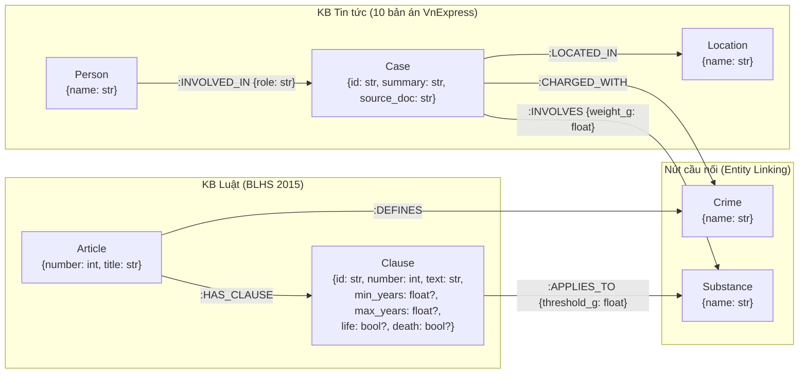
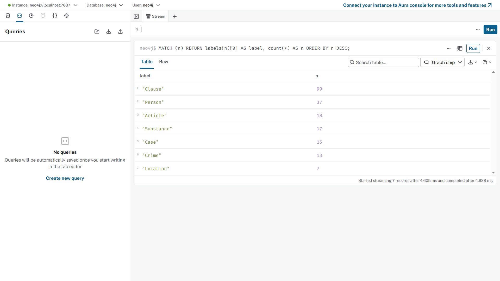
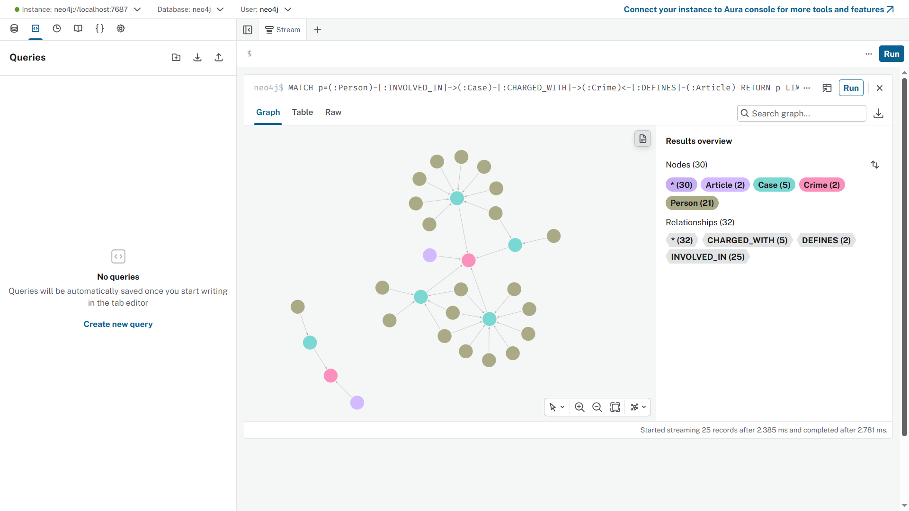
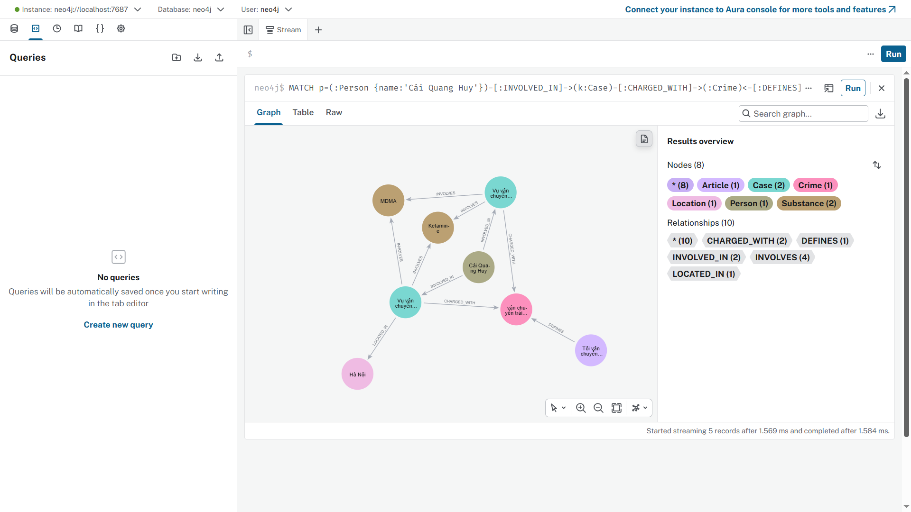

# Thiết kế Ontology — Ngày 19

> **Họ tên:** Nguyễn Thanh Giang  **MSSV:** 2A202602576  **Ngày:** 2026-10-05

---

## O1. Sơ đồ đồ thị (1.0 đ)



**Bảng tóm tắt thực thể (Node Labels):**

| Label | Khóa định danh (`MERGE` key) | Thuộc tính bổ sung | Nguồn dữ liệu | Số lượng thực tế (`kg_count.png`) |
|---|---|---|---|---:|
| `Article` | `number: int` (vd: `251`) | `title: str` | KB Luật (`data/law/blhs-2015-chuong-xx-ma-tuy.md`) | **18** |
| `Clause` | `id: str` (vd: `"251.2"`) | `number: int`, `text: str`, `min_years: float?`, `max_years: float?`, `life: bool?`, `death: bool?` | KB Luật | **99** |
| `Crime` | `name: str` (chuẩn hóa chữ thường, không tiền tố `"tội "`) | — | Cầu nối KB Luật & KB Tin tức | **13** |
| `Substance` | `name: str` (chuẩn hóa chữ thường: `"heroin"`, `"methamphetamine"`, …) | — | Cầu nối KB Luật & KB Tin tức | **17** |
| `Case` | `id: str` (`f"{doc_id}#c{idx}"`) | `summary: str`, `source_doc: str` | KB Tin tức (`data/news/*.md`) | **15** |
| `Person` | `name: str` (Title Case cho tên riêng) | — | KB Tin tức | **37** |
| `Location` | `name: str` (Title Case cho địa danh) | — | KB Tin tức | **7** |

**Bảng tóm tắt quan hệ (Relationship Types):**

| Kiểu cạnh | Chiều `(Nguồn)-[:CẠNH]->(Đích)` | Thuộc tính cạnh | Ý nghĩa ngữ nghĩa |
|---|---|---|---|
| `:HAS_CLAUSE` | `(Article)-[:HAS_CLAUSE]->(Clause)` | — | Điều luật bao gồm khoản luật tương ứng |
| `:DEFINES` | `(Article)-[:DEFINES]->(Crime)` | — | Điều luật quy định tội danh |
| `:APPLIES_TO` | `(Clause)-[:APPLIES_TO]->(Substance)` | `threshold_g: float` | Khoản luật áp dụng cho chất ma túy với ngưỡng khối lượng tối thiểu (gram) |
| `:INVOLVED_IN` | `(Person)-[:INVOLVED_IN]->(Case)` | `role: str` (`"bị cáo"`, `"đồng phạm"`, …) | Cá nhân tham gia vào vụ án với vai trò tố tụng |
| `:CHARGED_WITH` | `(Case)-[:CHARGED_WITH]->(Crime)` | — | Vụ án bị truy tố/xét xử về tội danh |
| `:INVOLVES` | `(Case)-[:INVOLVES]->(Substance)` | `weight_g: float` | Vụ án thu giữ tang vật chất ma túy với khối lượng (gram) |
| `:LOCATED_IN` | `(Case)-[:LOCATED_IN]->(Location)` | — | Vụ án xảy ra hoặc xét xử tại địa phương |

---

## O2. Quyết định thiết kế (1.0 đ)

### Quyết định 1: `role` là thuộc tính trên cạnh `:INVOLVED_IN` hay nút riêng `:Role`?

- **Lựa chọn:** Lưu `role` làm thuộc tính trực tiếp trên cạnh `(Person)-[:INVOLVED_IN {role: ...}]->(Case)`.
- **Lý do (Trade-off):**
  1. **Bản chất quan hệ phụ thuộc ngữ cảnh:** Vai trò tố tụng (`"bị cáo"`, `"người cầm đầu"`, `"đồng phạm"`, `"người vận chuyển"`) không phải là thuộc tính cố định của một `Person`, cũng không phải thực thể độc lập có thuộc tính riêng, mà là tư cách của một `Person` **trong một `Case` cụ thể** (cùng một người có thể là `"bị cáo"` ở vụ này nhưng là `"nhân chứng"` ở vụ khác).
  2. **Tối ưu độ dài đường đi (Hop count):** Khi giữ `role` trên cạnh `:INVOLVED_IN`, truy vấn từ `Person` sang `Crime` hoặc `Article` chỉ tốn đúng 3 bước nhảy: `(:Person)-[:INVOLVED_IN]->(:Case)-[:CHARGED_WITH]->(:Crime)<-[:DEFINES]-(:Article)`. Nếu tách thành nút trung gian `(:Person)-[:PLAYS]->(:Role)-[:IN_CASE]->(:Case)`, mọi truy vấn đều bị đội thêm 1 hop không cần thiết và làm phình số lượng nút/cạnh.
  3. **Khi nào mới cần nút `:Role` riêng?** Chỉ khi bài toán yêu cầu gắn siêu dữ liệu phân cấp cho từng vai trò (ví dụ: bảng quyền hạn/nghĩa vụ tố tụng của từng `Role` theo Bộ luật Tố tụng Hình sự). Với 6 câu hỏi benchmark hiện tại, thuộc tính trên cạnh là thiết kế gọn nhẹ và hiệu quả nhất.

### Quyết định 2: Khối lượng ma túy (`weight_g`, `threshold_g`) — thuộc tính cạnh hay nút riêng `:Quantity`?

- **Lựa chọn:** Lưu khối lượng làm thuộc tính số thực (`float`, đơn vị gram) trực tiếp trên cạnh: `weight_g` trên `(Case)-[:INVOLVES {weight_g}]->(Substance)` và `threshold_g` trên `(Clause)-[:APPLIES_TO {threshold_g}]->(Substance)`.
- **Lý do (Trade-off):**
  1. **Tránh bùng nổ nút giá trị rời rạc (Value Node Proliferation):** Khối lượng tang vật là đại lượng liên tục (`914.0` g, `1420.0` g, `70000.0` g…). Nếu tạo nút `:Quantity` cho mỗi con số, đồ thị sẽ sinh ra hàng chục nút lá cô lập (degree = 1) không có khả năng gom cụm hay tạo cầu nối giữa các vụ án.
  2. **Thuận tiện cho phép so sánh bất đẳng thức trong Cypher:** Khi lưu trực tiếp trên cạnh, bài toán đối chiếu khung hình phạt giữa thực tế vụ án và điều luật chỉ cần một mệnh đề `WHERE` trực tiếp trên cùng nút cầu nối `s:Substance`:
     ```cypher
     MATCH (k:Case)-[inv:INVOLVES]->(s:Substance)<-[app:APPLIES_TO]-(cl:Clause)
     WHERE inv.weight_g >= app.threshold_g
     ```
  3. **Đơn giản hóa việc chuẩn hóa đơn vị:** Ngay ở bước trích xuất (LLM prompt + `build_graph`), mọi đơn vị (`kg`, `gam`, `bánh heroin`) đã được quy đổi thống nhất về `gram` (`float`), nên không cần một nút `:Quantity {value, unit}` phức tạp.

### Quyết định 3: Độ mịn của nút `:Crime` — một nút `"tàng trữ trái phép chất ma túy"` hay tách theo từng khoản `"tàng trữ (khoản 4 điều 249)"`?

- **Lựa chọn:** Giữ độ mịn của `:Crime` ở **cấp độ tội danh (Article-level)** — tức một nút duy nhất `{name: "tàng trữ trái phép chất ma túy"}` liên kết với `(:Article {number: 249})` — thay vì tách nhỏ theo từng khoản (`Clause`).
- **Lý do (Trade-off):**
  1. **Tối đa hóa tỷ lệ Entity Linking thành công giữa 2 KB:** Trong thực tế báo chí (`data/news/*.md`), phóng viên hầu như chỉ viết *"bị truy tố về tội Mua bán trái phép chất ma túy"* hoặc *"tội Tàng trữ trái phép chất ma túy"*, rất hiếm khi ghi đầy đủ *"tội Tàng trữ trái phép chất ma túy theo điểm b khoản 4 Điều 249"*. Nếu tách nút `:Crime` theo từng khoản, chuỗi tên tội danh trích từ báo sẽ không thể khớp (`MERGE`) với nút `:Crime` trích từ luật, làm **đứt gãy hoàn toàn cầu nối liên-KB**.
  2. **Phân tách rõ trách nhiệm giữa `:Crime` và `:Clause`:** Trong ontology của chúng ta, `:Crime` đóng vai trò **cầu nối định danh tội** giữa `Case` và `Article` (`(:Case)-[:CHARGED_WITH]->(:Crime)<-[:DEFINES]-(:Article)`), còn việc định khung hình phạt chi tiết (khoản 1, 2, 3, 4) được phân giải qua nhánh `(:Article)-[:HAS_CLAUSE]->(:Clause)-[:APPLIES_TO {threshold_g}]->(:Substance)<-[:INVOLVES {weight_g}]-(:Case)`. Nhờ vậy, đồ thị vừa đảm bảo Recall liên kết cao, vừa giữ được độ chính xác đến từng khoản luật.

---

## O3. Ảnh chụp Neo4j Browser (0.5 đ)

> Các truy vấn đã chạy trên Neo4j Browser (`http://localhost:7474`) sau khi nạp đồ thị bằng `bench_kg.py` (**206 nodes, 388 relationships**).

### 1. Thống kê số lượng nút theo nhãn (`report/img/kg_count.png`)

```cypher
MATCH (n) RETURN labels(n)[0] AS label, count(*) AS n ORDER BY n DESC;
```



*Kết quả khớp chính xác với `ket_qua_benchmark_kg.txt` (tổng cộng **206 nút**: `Clause`: 99, `Person`: 37, `Article`: 18, `Substance`: 17, `Case`: 15, `Crime`: 13, `Location`: 7).*

### 2. Đường đi liên-KB từ Bị cáo → Vụ án → Tội danh ← Điều luật (`report/img/kg_cross_kb.png`)

```cypher
MATCH p=(:Person)-[:INVOLVED_IN]->(:Case)-[:CHARGED_WITH]->(:Crime)<-[:DEFINES]-(:Article)
RETURN p LIMIT 25;
```



*Quan sát: Các nút `:Crime` (`"mua bán trái phép chất ma túy"`, `"tàng trữ trái phép chất ma túy"`) đóng vai trò tâm điểm hội tụ (hub), nối hàng loạt bị cáo và vụ án từ KB Tin tức sang đúng `Article 251` và `Article 249` của KB Luật (30 nodes, 32 relationships).*

### 3. Đồ thị con hoàn chỉnh của một bị cáo cụ thể (`report/img/kg_my_case.png` — bị cáo `Cái Quang Huy`)

```cypher
MATCH p=(:Person {name:'Cái Quang Huy'})-[:INVOLVED_IN]->(k:Case)-[:CHARGED_WITH]->(:Crime)<-[:DEFINES]-(:Article)
OPTIONAL MATCH q=(k)-[:INVOLVES|LOCATED_IN]->()
RETURN p, q;
```



*Quan sát: Từ nút `Person {name: "Cái Quang Huy"}`, đồ thị nối qua `:INVOLVED_IN` tới `Case` (bản án tại `Location {name: "Quảng Trị"}`, tang vật `Substance {name: "methamphetamine"}` và `Substance {name: "ma túy tổng hợp"}`), tiếp tục qua `:CHARGED_WITH` tới `Crime {name: "vận chuyển trái phép chất ma túy"}` và nối ngược qua `:DEFINES` về `Article {number: 250}` của Bộ luật Hình sự. Đáng chú ý, đồ thị hiển thị 2 nút `Case` gắn với Cái Quang Huy: một từ bài báo chính `news-100260917203001265` và một từ đoạn tin liên quan ở cuối bài `news-100260918080821054` — minh chứng trực quan cho hiện tượng trùng lặp thực thể cấp vụ án sẽ phân tích ở mục E3 trong `REPORT_KG.md`.*
